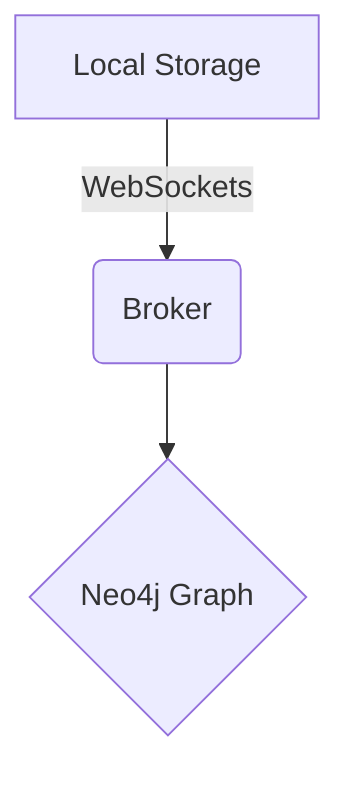

# Hello Madhu

# Technical Guide: Generating Thematic Verse for Subject Profile "Madhu Vinay"

## 1. Introduction and Scope Definition

This document outlines the technical methodology for constructing a coherent, rhythmic poem dedicated to an individual or subject identified as "Madhu Vinay." The goal is to structure the creative process into discrete, manageable phases, ensuring thematic consistency, adherence to poetic form, and optimal emotional impact.

**Objective:** To produce a finished poem (textual output) that celebrates and describes the attributes associated with Madhu Vinay.

**Scope:** The process focuses on literary execution and structural constraint utilization, rather than raw emotional output.

## 2. Prerequisites and Necessary Assets

Before initiating composition, the following assets must be collected and parameterized:

## 2.1 Subject Profile Data Collection (Mandatory Inputs)

- **Keywords List:** A minimum of 10 descriptive adjectives, nouns, and verbs related to the subject (e.g., *joy*, *wisdom*, *starlight*, *laughter*, *guide*).

- **Thematic Anchors:** Identify 2-3 core themes (e.g., resilience, charisma, intellectual depth).

- **Emotional Tone Matrix:** Define the desired emotional arc (e.g., Awe $\rightarrow$ Nostalgia $\rightarrow$ Celebration).

## 2.2 Structural Parameters (Constraints)

| Parameter | Definition | Acceptable Range | Notes |
| :--- | :--- | :--- | :--- |
| **Form** | Stanza pattern (e.g., Quatrain, Couplet). | 4-line stanzas recommended. | Ensures manageable rhythm. |
| **Rhyme Scheme** | Pattern of end rhymes. | AABB, ABAB, or ABCB. | Simple schemes are recommended for clarity. |
| **Meter/Rhythm** | Consistency of syllable count per line. | Iambic Tetrameter (8-10 syllables) is standard. | Using a consistent meter helps the poem *feel* stable. |

## 3. Methodology: Poetic Synthesis Workflow (The 5-Phase Model)

The poem generation process is broken down into five sequential phases:

## Phase 3.1: Input Normalization (Brainstorming)

- Cluster the collected keywords into thematic groups.

- Isolate strong imagery and high-impact metaphors that can serve as opening or closing lines.

## Phase 3.2: Structural Blueprinting (Mapping)

- Determine the total number of stanzas (e.g., 4 stanzas).

- Assign a specific theme or focus to each stanza (e.g., Stanza 1: Introduction; Stanza 2: Personality Traits; Stanza 3: Impact on Others; Stanza 4: Conclusion/Wish).

## Phase 3.3: Semantic Pairing and Rhyme Generation

- For every Line N, identify a rhyming pair for Line N+2, ensuring the pair contributes semantically relevant content.

- Focus on creating *assonance* (vowel sound repetition) and *consonance* (consonant sound repetition) alongside end rhymes to enhance musicality.

## Phase 3.4: Drafting and Implementation (Code Block Analogy)

This uses pseudocode to illustrate the iterative drafting process:

```pseudocode
FUNCTION GeneratePoem(Subject, Themes, Form)
    PoemText = []
    
    FOR StanzaIndex FROM 1 TO TotalStanzas DO
        CurrentTheme = GetTheme(StanzaIndex, Themes)
        
        Stanza = []
        
        FOR LineIndex FROM 1 TO LinesPerStanza DO
            Keyword = SelectRandomKeyword(CurrentTheme)
            Rule = ApplyMetaphor(Subject, Keyword)
            
            LineText = ConstructLine(Concept="Verse about Madhu Vinay", Guideline=Rule)
            Stanza.APPEND(LineText)
        
        PoemText.append(Stanza)
        
    END FOR
    
    RETURN JOIN(PoemText, "\n\n")
END FUNCTION
```

## Phase 3.5: Refinement and Polish (Tone Check)

- Review the compiled poem against the initial Emotional Tone Matrix.

- Replace any overly cliché or generic phrases with more precise, evocative language.

## 4. Technical Components: Literary Devices Implementation

The effective use of literary devices acts as the "library functions" for the poetry.

## 4.1 Defining Key Functions

- **Metaphor:** Establishes an implied equivalence (e.g., *Skill $\rightarrow$ guiding star*).

:::callout
    Use metaphors to make abstract qualities (like kindness) concrete and visible to the reader.
    :::callout
*   **Alliteration:** Repetition of initial consonant sounds (e.g., *S*un *s*eems *s*hining). This enhances the perceived rhythm.
*   **Imagery:** Appeal to the five senses (sight, sound, smell, taste, touch). *Example: The scent of sandalwood.*

## 5. Process Flow Diagram

The entire compositional journey can be visualized using a flow diagram detailing inputs, transformation steps, and final outputs.

:::mermaid
graph TD
    A[Start: Subject Profile (Madhu Vinay)] --> B{Define Form & Constraints};
    B --> C[Phase 1: Input Normalization (Keywords/Themes)];
    C --> D[Phase 2: Structural Blueprinting (Stanza Themes)];
    D --> E[Phase 3: Semantic Pairing (Rhyme/Meter Check)];
    E --> F[Phase 4: Drafting & Implementation (Verse Composition)];
    F --> G{Review: Emotional Tone Check};
    G -- Needs Refinement --> E;
    G -- Approved --> H[Output: Completed Poem];
:::

## 6. Recommendations and Best Practices

- **Iteration is Key:** Do not assume the first draft is final. Treat revision as a necessary patch cycle.

- **Avoid Over-Specification:** While strict rhyme schemes are helpful, occasionally breaking a rule (e.g., using internal rhyme when the end rhyme is weak) can introduce genuine artistic flair.

- **Validation Check:** Always read the poem aloud. If the rhythm falters or the phrases feel awkward, the line segment must be re-engineered.

{"id":"shp-1780322754256","type":"pen","points":[{"x":108,"y":139.5},{"x":108,"y":137.5},{"x":118,"y":125.5},{"x":138,"y":106.5},{"x":167,"y":83.5},{"x":193,"y":71.5},{"x":226,"y":63.5},{"x":229,"y":63.5},{"x":229,"y":68.5},{"x":222,"y":97.5},{"x":207,"y":137.5},{"x":205,"y":149.5},{"x":205,"y":151.5},{"x":239,"y":140.5},{"x":259,"y":137.5},{"x":266,"y":137.5},{"x":268,"y":138.5},{"x":275,"y":149.5},{"x":289,"y":163.5},{"x":316,"y":173.5},{"x":344,"y":176.5},{"x":395,"y":172.5},{"x":431,"y":156.5},{"x":450,"y":142.5},{"x":452,"y":135.5},{"x":453,"y":135.5},{"x":454,"y":135.5},{"x":459,"y":142.5}],"x":0,"y":0,"width":0,"height":0,"color":"#ffffff","thickness":3}:::callout
Start writing here...
:::

# Technical Specification: Systemic Decay Analysis (SDA) – Addressing Conceptual "Rot"

## 1. Introduction and Scope

This document provides a detailed technical guide for identifying, analyzing, and mitigating systemic degradation, referred to herein as "Rot." In a technical context, "Rot" signifies a gradual, often non-linear decline in the functionality, integrity, or stability of a system, architectural component, or dataset.

The purpose of this guide is to standardize the methodology for assessing levels of decay, moving beyond mere symptom identification to root cause analysis (RCA).

:::callout
**Target Audience:** System Architects, DevOps Engineers, Reliability Engineers, Data Integrity Specialists.
**Prerequisites:** Understanding of failure domain analysis (FDA) and decay modeling.
:::

## 2. Taxonomy of Degradation (Types of Rot)

Rot can manifest across various technical layers. Understanding the specific domain of failure is crucial for selecting the correct remediation pipeline.

## 2.1. Structural Rot (Architectural Decay)

This type involves inherent flaws in the foundational design that become problematic as the system scales or acquires new features (Technical Debt).

- **Tight Coupling:** Components are overly reliant on the internal workings of other components, making independent updates risky.

- **Knowledge Silos:** Critical operational knowledge is held by specialized individuals rather than being documented within the system or codebase.

- **Outdated Dependencies:** Reliance on library versions or frameworks that are unmaintained or reach end-of-life (EOL).

## 2.2. Logical Rot (Code Decay)

This occurs within the source code itself, representing deterioration of maintainability and predictability.

- **Feature Creep:** The gradual addition of features without corresponding refactoring or modularization.

- **Spaghetti Code:** Overly complex function structures with highly entangled control flows (deep nesting of `if`/`else` blocks).

- **Ambiguity:** Use of poorly typed variables or insufficient defensive programming practices.

## 2.3. Data Rot (Informational Decay)

This pertains to the degradation of the quality or relevance of stored data over time.

- **Schema Drift:** The structure of the underlying data (e.g., a database column) changes without updating consuming applications.

- **Stale Records:** Data that was once accurate but is no longer representative of the current business state (e.g., old user credentials).

- **Ingestion Error:** Failure to validate or sanitize incoming data streams, leading to corruption.

## 3. Detection and Monitoring Mechanisms

Effective monitoring requires quantitative metrics and algorithmic detection techniques rather than subjective assessments.

## 3.1. Measuring Decay Metrics (K-Metrics)

We recommend quantifying rot using a weighted array of Key Metrics (K-Metrics).

- **Cyclomatic Complexity ($\text{CC}$):** A measure of the number of linearly independent paths through a program's source code. High $\text{CC}$ correlates strongly with higher logical rot.

- **Churn Rate:** The frequency of changes (additions, deletions, modifications) in specific modules over time. High local churn without corresponding test coverage suggests high instability.

- **Mean Time To Resolution ($\text{MTTR}$)/Mean Time Between Failure ($\text{MTBF}$):** Tracking rising $\text{MTTR}$ suggests poor diagnostic capabilities or system fragmentation (structural rot).

## 3.2. Implementing Decay Detection (Pseudocode)

The following Python function demonstrates a basic mechanism for flagging modules that exceed predefined complexity thresholds, indicating potential logical rot.

```python
def assess_module_rot(module_data: dict, complexity_threshold: int = 15) -> list:
    """
    Analyzes module metadata to identify units exceeding accepted complexity thresholds.

    :param module_data: Dictionary containing module metrics.
    :param complexity_threshold: Maximum acceptable Cyclomatic Complexity.
    :return: List of modules flagged as 'High Decay Risk'.
    """
    high_decay_risk = []
    for module_name, metrics in module_data.items():
        if metrics.get('cc') > complexity_threshold:
            high_decay_risk.append({
                'module': module_name,
                'reason': f"CC Score ({metrics['cc']}) exceeds threshold ({complexity_threshold}).",
                'fix_priority': 'High'
            })
        elif metrics.get('test_coverage') < 0.6:
            # Complementary check for incomplete testing
            high_decay_risk.append({
                'module': module_name,
                'reason': "Low test coverage (<60%), increasing risk of undetected failure.",
                'fix_priority': 'Moderate'
            })
    return high_decay_risk

# Example Usage:
# decay_report = assess_module_rot({"UserAuth": {'cc': 22, 'test_coverage': 0.8}, "PaymentProcessor": {'cc': 10, 'test_coverage': 0.4}})
# print(decay_report)
```

## 4. Mitigation and Prevention Strategy (The Refactoring Lifecycle)

Addressing Rot requires a disciplined, multi-stage approach rather than a single-point fix.

## 4.1. Immediate Remediation (The Patch)

When Rot is discovered, the goal is immediate stability:

- **Isolation:** Implement circuit breakers or bulkheads to prevent a failure in one module from cascading throughout the entire system.

- **Read-Only Mode:** If data rot is critical, temporarily switch affected datasets to read-only until validation pipelines are restored.

- **Feature Freeze:** Halt the deployment of new features in the affected domain until the root decay is fully addressed.

## 4.2. Long-Term Prevention (The Hardening)

Preventing Rot is achieved through process and architectural resilience:

- **Bounded Contexts:** Enforce strict domain boundaries (DDD principles). Components should only communicate via defined, stable APIs, never direct internal calls.

- **Contract Testing:** Use contract testing tools (e.g., Pact) to ensure consuming services validate the expected schema and behavior of provider services, thereby preventing structural rot due to schema drift.

- **Automated Linting/Static Analysis:** Integrate advanced code quality tools (e.g., SonarQube) into the CI/CD pipeline. Configure mandatory failures if defined decay metrics (Cyclomatic Complexity, duplication percentage) are exceeded.

## 4.3. Architectural Flow Diagram

The following diagram illustrates the systemic loop for maintenance and decay prevention.

:::mermaid
graph TD
    A[Codebase/System State] -->|Monitoring & Test| B{Decay Detector};
    B -->|Threshold Exceeded?| C{High Rot Detected?};
    C -- Yes --> D[Root Cause Analysis (RCA)];
    D --> E[Strategic Remediation Plan];
    E --> F[Refactoring / Refactoring Pipeline];
    F --> G[Increased Test Coverage + CI/CD];
    G --> A;
    C -- No --> H[Routine Operation];
    H --> A;
પી
:::

:::whiteboard
[{"id":"shp-1780322755289","type":"pen","points":[{"x":371,"y":116.25},{"x":357,"y":115.25},{"x":345,"y":112.25},{"x":341,"y":112.25},{"x":339,"y":112.25},{"x":336,"y":114.25},{"x":335,"y":116.25}],"x":0,"y":0,"width":0,"height":0,"color":"#ffffff","thickness":3},{"id":"shp-1780322755673","type":"pen","points":[{"x":390,"y":138.25},{"x":419,"y":150.25},{"x":424,"y":151.25},{"x":424,"y":152.25},{"x":425,"y":152.25},{"x":435,"y":158.25},{"x":458,"y":169.25},{"x":516,"y":187.25},{"x":550,"y":196.25},{"x":595,"y":205.25},{"x":607,"y":207.25},{"x":607,"y":208.25},{"x":604,"y":209.25},{"x":598,"y":209.25},{"x":593,"y":208.25},{"x":583,"y":208.25},{"x":571,"y":208.25},{"x":568,"y":208.25}],"x":0,"y":0,"width":0,"height":0,"color":"#ffffff","thickness":3},{"id":"shp-1780322756091","type":"pen","points":[{"x":292,"y":154.25},{"x":287,"y":154.25},{"x":281,"y":154.25},{"x":278,"y":154.25},{"x":275,"y":154.25},{"x":275,"y":155.25},{"x":278,"y":160.25},{"x":279,"y":160.25},{"x":279,"y":161.25}],"x":0,"y":0,"width":0,"height":0,"color":"#ffffff","thickness":3},{"id":"shp-1780322756392","type":"pen","points":[{"x":239,"y":153.25},{"x":219,"y":152.25},{"x":210,"y":157.25},{"x":208,"y":164.25},{"x":208,"y":168.25},{"x":209,"y":174.25},{"x":221,"y":186.25},{"x":232,"y":192.25},{"x":252,"y":202.25},{"x":271,"y":209.25},{"x":294,"y":218.25},{"x":308,"y":223.25},{"x":314,"y":225.25}],"x":0,"y":0,"width":0,"height":0,"color":"#ffffff","thickness":3},{"id":"shp-1780322767935","type":"pen","points":[{"x":220,"y":167.25},{"x":214,"y":167.25},{"x":197,"y":170.25},{"x":177,"y":175.25},{"x":150,"y":183.25},{"x":133,"y":194.25},{"x":124,"y":209.25},{"x":124,"y":217.25},{"x":127,"y":220.25},{"x":132,"y":221.25},{"x":141,"y":223.25},{"x":165,"y":223.25},{"x":176,"y":214.25},{"x":181,"y":206.25},{"x":181,"y":196.25},{"x":181,"y":188.25},{"x":174,"y":181.25},{"x":166,"y":180.25},{"x":153,"y":189.25},{"x":145,"y":200.25},{"x":141,"y":217.25},{"x":145,"y":224.25},{"x":150,"y":227.25},{"x":161,"y":230.25},{"x":178,"y":230.25}],"x":0,"y":0,"width":0,"height":0,"color":"#ffffff","thickness":3},{"id":"shp-1780322768189","type":"pen","points":[{"x":191,"y":189.25},{"x":157,"y":190.25},{"x":149,"y":198.25},{"x":147,"y":203.25},{"x":148,"y":205.25},{"x":153,"y":207.25},{"x":167,"y":211.25},{"x":193,"y":214.25},{"x":219,"y":214.25},{"x":226,"y":214.25}],"x":0,"y":0,"width":0,"height":0,"color":"#ffffff","thickness":3},{"id":"shp-1780322768452","type":"pen","points":[{"x":201,"y":194.25},{"x":180,"y":183.25},{"x":158,"y":176.25},{"x":147,"y":173.25},{"x":127,"y":165.25},{"x":100,"y":158.25},{"x":86,"y":154.25},{"x":52,"y":144.25},{"x":36,"y":140.25},{"x":12,"y":135.25},{"x":5,"y":135.25}],"x":0,"y":0,"width":0,"height":0,"color":"#ffffff","thickness":3},{"id":"shp-1780322769773","type":"pen","points":[{"x":365,"y":40.25},{"x":375,"y":40.25},{"x":376,"y":40.25},{"x":392,"y":45.25},{"x":419,"y":53.25},{"x":447,"y":58.25},{"x":486,"y":64.25},{"x":539,"y":73.25},{"x":571,"y":74.25},{"x":587,"y":74.25},{"x":601,"y":76.25},{"x":612,"y":76.25},{"x":626,"y":76.25},{"x":629,"y":76.25},{"x":632,"y":76.25},{"x":634,"y":76.25},{"x":636,"y":76.25},{"x":637,"y":75.25},{"x":639,"y":75.25},{"x":640,"y":74.25},{"x":641,"y":74.25},{"x":642,"y":74.25}],"x":0,"y":0,"width":0,"height":0,"color":"#ffffff","thickness":3},{"id":"shp-1780322770927","type":"pen","points":[{"x":595,"y":70.25},{"x":594,"y":69.25},{"x":593,"y":69.25},{"x":590,"y":68.25},{"x":584,"y":67.25},{"x":577,"y":67.25},{"x":570,"y":67.25},{"x":546,"y":67.25},{"x":523,"y":70.25},{"x":495,"y":72.25},{"x":452,"y":73.25},{"x":435,"y":75.25},{"x":399,"y":78.25},{"x":380,"y":80.25},{"x":339,"y":83.25},{"x":323,"y":84.25},{"x":297,"y":86.25},{"x":280,"y":86.25},{"x":262,"y":88.25},{"x":234,"y":88.25},{"x":218,"y":89.25},{"x":205,"y":90.25},{"x":188,"y":92.25},{"x":178,"y":94.25},{"x":171,"y":95.25},{"x":168,"y":96.25}],"x":0,"y":0,"width":0,"height":0,"color":"#ffffff","thickness":3},{"id":"shp-1780322771955","type":"pen","points":[{"x":13,"y":50.25},{"x":14,"y":50.25},{"x":21,"y":50.25},{"x":41,"y":49.25},{"x":71,"y":47.25},{"x":118,"y":45.25},{"x":196,"y":45.25},{"x":257,"y":45.25},{"x":300,"y":45.25},{"x":334,"y":46.25},{"x":354,"y":48.25},{"x":380,"y":52.25},{"x":385,"y":53.25},{"x":386,"y":53.25},{"x":387,"y":54.25},{"x":388,"y":54.25},{"x":388,"y":56.25},{"x":390,"y":57.25}],"x":0,"y":0,"width":0,"height":0,"color":"#ffffff","thickness":3},{"id":"shp-1780322773617","type":"pen","points":[{"x":86,"y":46.25},{"x":87,"y":46.25},{"x":106,"y":54.25},{"x":125,"y":67.25},{"x":135,"y":79.25},{"x":156,"y":107.25},{"x":176,"y":129.25},{"x":189,"y":138.25},{"x":206,"y":145.25},{"x":229,"y":147.25},{"x":254,"y":147.25},{"x":286,"y":147.25},{"x":314,"y":153.25},{"x":343,"y":161.25},{"x":374,"y":174.25},{"x":405,"y":188.25},{"x":444,"y":215.25},{"x":489,"y":249.25},{"x":511,"y":267.25},{"x":516,"y":276.25},{"x":514,"y":283.25},{"x":487,"y":302.25},{"x":443,"y":317.25},{"x":369,"y":311.25},{"x":275,"y":283.25},{"x":231,"y":270.25},{"x":201,"y":253.25},{"x":166,"y":215.25},{"x":152,"y":197.25},{"x":149,"y":194.25},{"x":149,"y":193.25},{"x":152,"y":215.25},{"x":148,"y":232.25},{"x":145,"y":248.25},{"x":150,"y":282.25},{"x":195,"y":320.25}],"x":0,"y":0,"width":0,"height":0,"color":"#ffffff","thickness":3},{"id":"shp-1780322774817","type":"pen","points":[{"x":617,"y":108.25},{"x":628,"y":132.25},{"x":674,"y":228.25}],"x":0,"y":0,"width":0,"height":0,"color":"#ffffff","thickness":3},{"id":"shp-1780322776149","type":"pen","points":[{"x":470,"y":136.25},{"x":470,"y":135.25},{"x":481,"y":130.25},{"x":494,"y":120.25},{"x":497,"y":116.25},{"x":491,"y":115.25},{"x":461,"y":116.25},{"x":405,"y":118.25},{"x":341,"y":119.25},{"x":254,"y":127.25},{"x":180,"y":139.25},{"x":96,"y":148.25},{"x":1,"y":148.25}],"x":0,"y":0,"width":0,"height":0,"color":"#ffffff","thickness":3},{"id":"shp-1780322778031","type":"pen","points":[{"x":76,"y":93.25},{"x":78,"y":93.25},{"x":84,"y":94.25},{"x":93,"y":100.25},{"x":121,"y":132.25},{"x":132,"y":144.25},{"x":180,"y":213.25},{"x":187,"y":218.25},{"x":188,"y":219.25},{"x":183,"y":232.25},{"x":173,"y":256.25},{"x":182,"y":311.25}],"x":0,"y":0,"width":0,"height":0,"color":"#ffffff","thickness":3}]
:::

| Item | Qty | Cost |
|---|---|---|
| Subscription | 1 | $12 |
| Domain | 1 | $15 |

